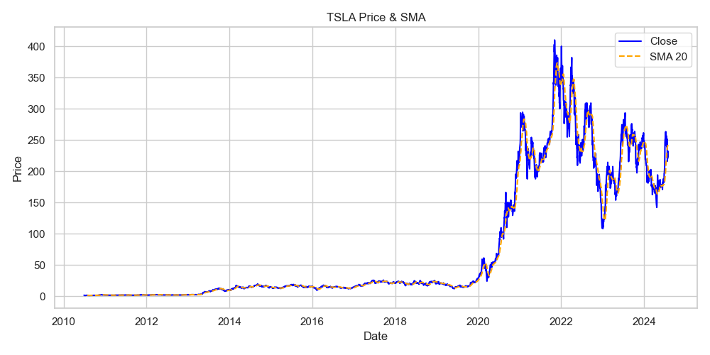

# Stock Technical Analysis Project



## 📌 Project Overview
This project performs technical analysis on 7 major tech stocks:
- TSLA (Tesla)
- NVDA (NVIDIA)
- META (Meta/Facebook)
- AMZN (Amazon)
- GOOG (Alphabet/Google)
- AAPL (Apple)
- MSFT (Microsoft)

## 📊 Key Features
- **Technical Indicators Calculation**:
  - 20-day Simple Moving Average (SMA)
  - 14-day Relative Strength Index (RSI)
  - Moving Average Convergence Divergence (MACD)
- **Automated Visualization**:
  - Price + SMA charts
  - RSI charts with overbought/oversold levels
  - MACD histograms
- **Data Processing**:
  - Robust OHLCV data loading
  - Automatic date parsing
  - Missing data handling

## 🛠 Technical Implementation

### Dependencies
```python
import pandas as pd
import talib
import matplotlib.pyplot as plt
import seaborn as sns
import numpy as np
import logging

## file structure 

project/
├── data/
│   ├── TSLA_historical_data.csv
│   ├── NVDA_processed.pkl
│   └── processed_news_data.pkl
├── Plots-task2/
│   ├── TSLA_sma.png
│   ├── AAPL_rsi.png
│   └── NVDA_macd.png
├── notebooks
|   ├── Quantitative-analysis.ipynb
└── README.md