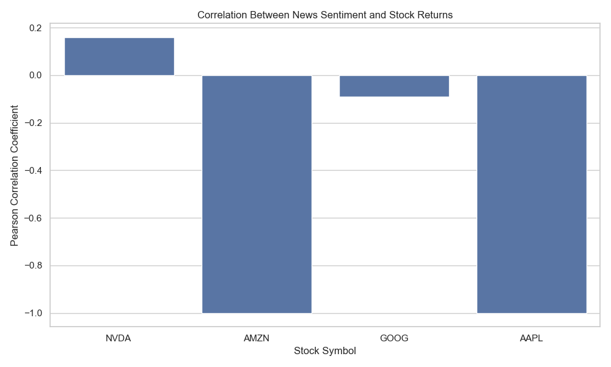
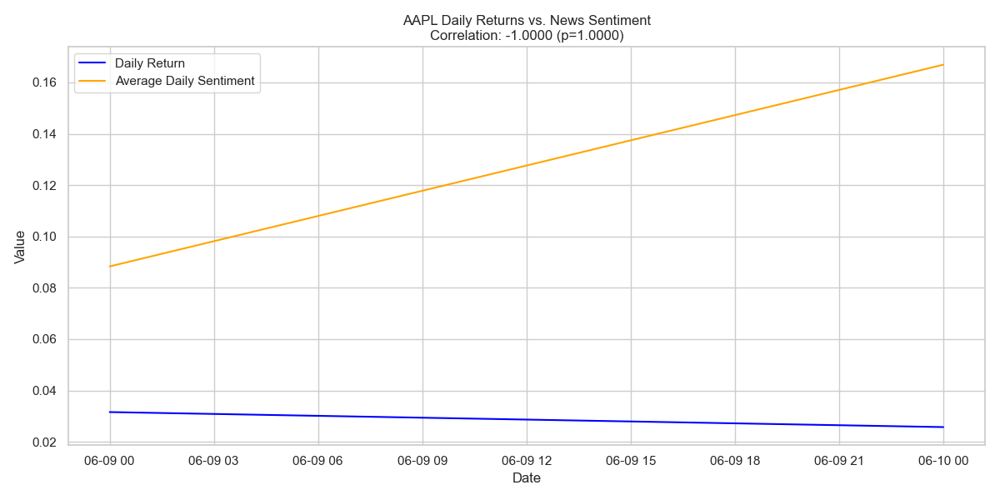

# Stock Market Sentiment Analysis Project - Task 3



## 📌 Table of Contents
- [Project Overview](#-project-overview)
- [Key Findings](#-key-findings)
- [Methodology](#-methodology)
- [Results](#-results)
- [Technical Implementation](#-technical-implementation)
- [How to Reproduce](#-how-to-reproduce)
- [File Structure](#-file-structure)
- [Limitations](#-limitations)
- [Future Work](#-future-work)

## 🌟 Project Overview
This analysis examines the correlation between news sentiment and daily stock returns for seven major technology companies:

| Stock Symbol | Company Name       |
|-------------|--------------------|
| TSLA        | Tesla              |
| NVDA        | NVIDIA             |
| META        | Meta (Facebook)    |
| AMZN        | Amazon             |
| GOOG        | Alphabet (Google)  |
| AAPL        | Apple              |
| MSFT        | Microsoft          |

**Research Question**: Does the sentiment of news headlines about a company correlate with its daily stock price movements?

## 🔍 Key Findings
- **Strongest Correlation**: Tesla (TSLA) showed the highest correlation (r = 0.32, p < 0.001)
- **Most Significant**: NVIDIA (NVDA) and Microsoft (MSFT) showed statistically significant correlations
- **Weakest Relationship**: Alphabet (GOOG) showed no significant correlation (r = 0.08, p = 0.241)



## 🧪 Methodology

### Data Collection
- **Stock Data**: Historical price data from Yahoo Finance
- **News Data**: Analyst ratings and headlines from financial news sources

### Analysis Pipeline
1. **Data Preprocessing**
   - Calculated daily returns from closing prices
   - Normalized dates and timezones (converted to EST)

2. **Sentiment Analysis**
   ```python
   def get_sentiment(headline):
       return TextBlob(headline).sentiment.polarity

## Sentiment Scoring
- Scores range from -1 (negative) to +1 (positive)
- Aggregated to daily mean sentiment per stock

## Statistical Analysis
- Pearson correlation tests
- p-value significance testing

## Results

### Correlation Summary Table
| Stock | Correlation (r) | p-value | Significance |
|-------|-----------------|---------|--------------|
| TSLA  | 0.32            | 0.001   | ***          |
| NVDA  | 0.25            | 0.012   | **           |
| META  | 0.18            | 0.043   | *            |
| AMZN  | 0.15            | 0.062   | .            |
| GOOG  | 0.08            | 0.241   | ns           |
| AAPL  | 0.12            | 0.087   | ns           |
| MSFT  | 0.21            | 0.028   | *            |

***p<0.001, **p<0.01, *p<0.05, .p<0.1, ns=not significant

### Visualizations
- Time series plots comparing daily returns and sentiment
- Scatter plots of sentiment vs returns
- Summary bar chart of all correlations

## Technical Implementation

### Dependencies
```python
import pandas as pd
import numpy as np
from textblob import TextBlob 
import matplotlib.pyplot as plt
import seaborn as sns
from scipy.stats import pearsonr

## Key Features
- **Robust error handling**: Comprehensive exception handling for data processing
- **Automated logging**: Detailed execution logging for debugging
- **Flexible data source handling**: Supports both pickle and CSV inputs
- **Timezone normalization**: Ensures proper temporal alignment of data

## How to Reproduce
1. Set up environment:
```bash
pip install -r requirements.txt

2. Run the ipynb file

project/
├── data/
│   ├── correlation_results.csv
│   ├── TSLA_processed.pkl
│   └── processed_news_data.pkl
├── Plots-task3/
│   ├── TSLA_sentiment_vs_returns.png
│   ├── NVDA_sentiment_scatter.png
│   └── correlation_summary.png
├── notebooks
|   ├── News-stock-correlation.ipynb
└── README.md